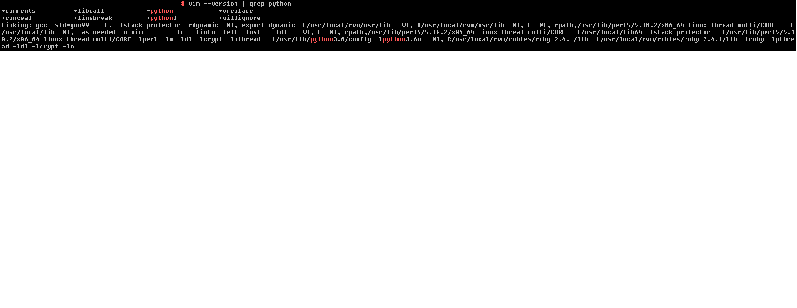

# Tips for install & configure vim 8.x on CentOS 7.6
:octocat: Just a memo for me for setup VIM as IDE
```
$ cat /etc/centos-release
CentOS Linux release 7.6.1810 (Core)
```

:black_medium_small_square: <b>Install all the prerequisite libraries</b>

```
$ yum install gcc make ncurses ncurses-devel
$ yum install ctags git tcl-devel \
ruby    ruby-devel     \
lua     lua-devel      \
luajit  luajit-devel   \
python  python-devel   \
python3 python3-devel  \
perl    perl-devel     \
perl-ExtUtils-ParseXS  \
perl-ExtUtils-XSpp     \
perl-ExtUtils-CBuilder \
perl-ExtUtils-Embed
```

:black_medium_small_square: <b>Remove the existing Vim if you have already installed it</b>
```
$ yum list installed | grep -i vim
$ yum remove vim-enhanced vim-common vim-filesystem
```

:black_medium_small_square: <b>Download Vim source</b>
```
$ git clone https://github.com/vim/vim.git
$ cd vim
```

:black_medium_small_square: <b>Configure</b>
```
$ ./configure --with-features=huge \
--enable-multibyte \
--enable-python3interp \
--enable-rubyinterp \
--enable-perlinterp \
--enable-luainterp \
--enable-cscope \
--enable-largefile \
--enable-fail-if-missing \
--prefix=/usr/local/
```

:label: **Note:** 
> VIM does ***NOT*** support `python` and `python3` ***at the same time***.  
**UltiSnips.vim** has some problem with python, error like below would
occur with python  
```
E837: This Vim cannot execute :py3 after using :python  
```
:triangular_flag_on_post:It is recommended to compile vim with ***python3*** support.

You can use below method to check your vim's python enablement:
Enter command mode, type `:echo has('python3')` or `:echo has('python')`.
If the output is **'1'**, it means supported, else the output is **'0'**.  


:black_medium_small_square: <b>Build and install</b>
```
$ make
$ make install
```

:black_medium_small_square: <b>Check Vim version</b>
```
$ vim --version | less
```
check if: **+lua** **+multi_byte** **+perl** **+python3** **+ruby** 
 

:black_medium_small_square: <b>Change color scheme of vim</b>   
1. Enter command mode and input ":terminal"
2. Check available color scheme in the system by command 
```
$ ls -l /usr/share/vim/vim*/colors/
```
3. Edit "~/.vimrc" and add below lines
```
syntax on
colorscheme torte
```
> **Note:** The `torte` here is the color scheme you choose for update

- Add `ls` related command to `/usr/bin` 
```
$ ln -s /usr/local/bin/vim /usr/bin/vim 
$ ln -s /usr/local/bin/vimdiff /usr/bin/vimdiff 
$ ln -s /usr/local/bin/vimtutor /usr/bin/vimtutor 
```

## To customize VIM into one IDE   
:heavy_check_mark: <b>Install the dependency, including nodejs, ag</b>

1. First, update the local repository to ensure you install the latest versions of Node.js and npm. Type in the following command:
```c
$ sudo yum update
```
2. Next, add the NodeSource repository to the system with:
```c
$ curl -sL https://rpm.nodesource.com/setup_10.x | sudo bash -
```
3. The output will prompt you to use the following command if you want to install Node.js and npm:
```c
$ sudo yum install -y nodejs
```
4. Finally, verify the installed software with the commands:
```c
$ node -version
$ npm -version
```  


:label:<b>Reference</b>   
- [install-node-js-npm-centos](https://phoenixnap.com/kb/install-node-js-npm-centos)

5. Installing ag on CentOS  
> Prerequistes
>- [libpcre](https://centos.pkgs.org/7/centos-x86_64/pcre-8.32-17.el7.x86_64.rpm.html)
>- [liblzma](https://centos.pkgs.org/7/centos-x86_64/xz-devel-5.2.2-1.el7.x86_64.rpm.html)  


##### Download, build and install

```c
$ sudo yum install -y pcre-devel
$ sudo yum install xz-devel
$ cd /usr/local/src
$ sudo git clone https://github.com/ggreer/the_silver_searcher.git
$ cd the_silver_searcher
$ sudo ./build.sh
$ sudo make install
$ which ag

## Another way to install ag
$ yum install -y the_silver_searcher
```  


:label:<b>Reference</b>  
- [Installing ag on CentOS](https://gist.github.com/rkaneko/988c3964a3177eb69b75)  

6. Clone and install vim config  
```c
$ git clone https://github.com/sebdah/vim-ide.git
$ cd vim-ide
$ sudo ./install.sh
```


## neovim installation:atom:
```
## https://github.com/neovim/neovim/wiki/Installing-Neovim
$ yum -y install epel-release
$ curl -o /etc/yum.repos.d/dperson-neovim-epel-7.repo https://copr.fedorainfracloud.org/coprs/dperson/neovim/repo/epel-7/dperson-neovim-epel-7.repo 
$ yum -y install neovim --enablerepo=epel
```


The default path of Neovim:  
- **~/.vimrc** has been replaced with **~/.config/nvim/init.vim**. If you install neovim success but this folder does not display, you can create it manually.
- **~/.vim** folder has been replaced with **~/.local/share/nvim/site** folder.


:label: <b>Reference</b>
- [vim-ide](https://github.com/sebdah/vim-ide)  
- [vimawesome](https://vimawesome.com/)  
- [vim-go-setup](https://tpaschalis.github.io/vim-go-setup/)  

## How to fix VIM could not display color scheme properly in TMUX sessions
Add or update the `TERM` in `/etc/proflie` and set it to `xterm-256color` as below
```
TERM=xterm-256color
export TERM
```
To make the change take effects, you need to reboot host or `source /etc/profile`
Besides, please make sure below configuration exists in your `~/.vimrc`
```
set t_Co=256
set background=dark
```
